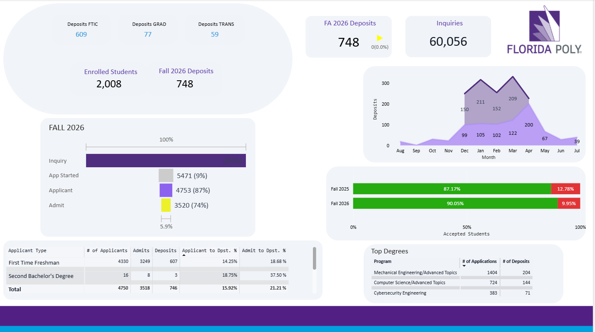
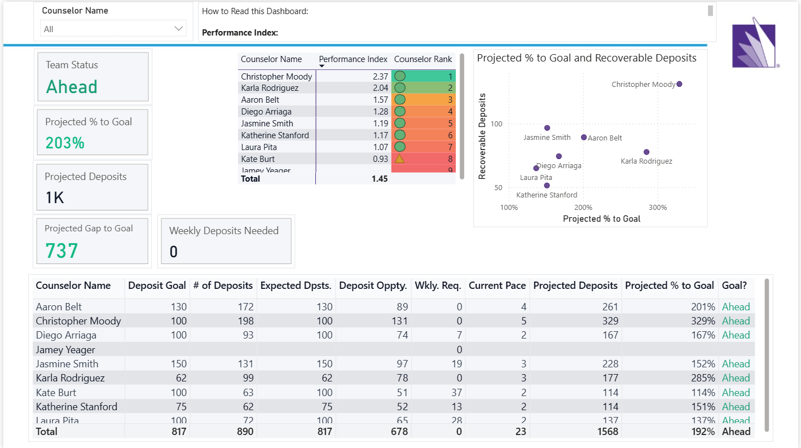
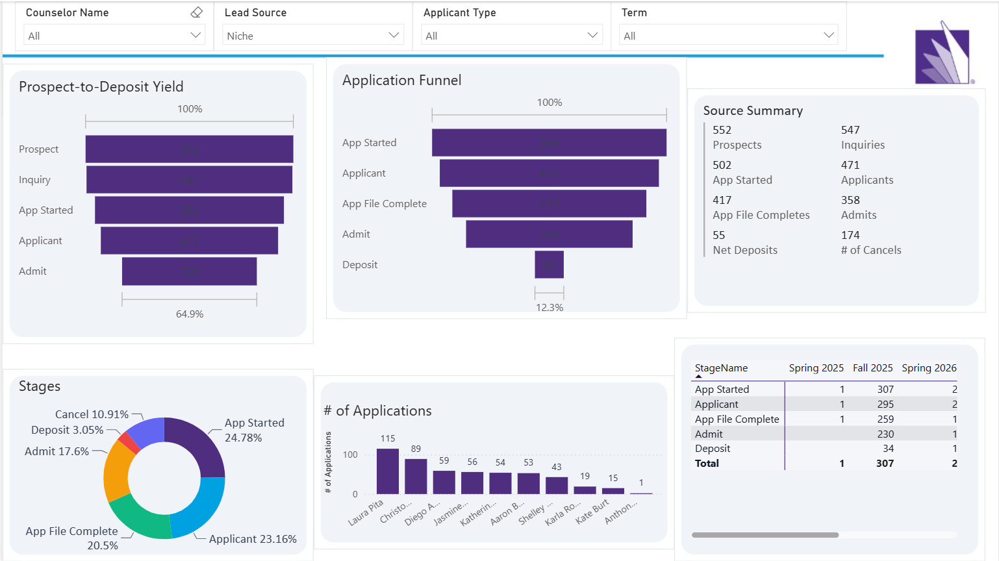

# Meridian Fitness Group — Sales & Revenue Analytics

A 14-page Power BI dashboard covering the full sales lifecycle for a
membership-based business: lead generation → pipeline → close → activation →
retention, plus rep performance, quota pacing, and forecasting.

**Built for:** VP of Sales / Sales Ops
**Refresh cadence:** Daily
**Stack:** Power BI (Power Query, DAX), CRM source data (Salesforce-style
object model)

> **A note on this project:** the dashboard was originally built for real
> university enrollment operations (leads → applications → deposits →
> enrolled students). The data model, relationships, and all 150+ DAX
> measures below are unchanged — I relabeled the visible terminology to a
> fictional gym-membership sales company so the work is legible to any BI or
> sales-analytics recruiter, not just higher-ed. See
> [`docs/rebrand-glossary.md`](docs/rebrand-glossary.md) for the exact
> term mapping. I'm glad to speak to either the original context or the
> sales framing in an interview — the analytical work is identical either
> way.

---

## Screenshots

<!-- Drop your exported PNGs into /screenshots using these filenames and
     these embeds will render automatically on GitHub. See docs/page-tour.md
     for the full page list and naming convention. -->

**Sales Overview**


**Quota Progress (Pacing Model)**


**Sales Funnel Analysis**


*(Full page list, including pages not shown above, in
[`docs/page-tour.md`](docs/page-tour.md).)*

---

## Why this is more than a "pretty dashboard"

- **A working quota-pacing engine**, not just a static KPI. Rolling 4-week
  velocity is measured against remaining time-to-goal to produce a live
  "will we hit the number" projection, blended into a weighted rep
  performance index.
- **A dynamic, self-referencing sales funnel.** Stage-over-stage conversion
  is computed by walking stage order via `TREATAS`, so the formula doesn't
  need to be touched if a pipeline stage is added or removed.
- **Rep leaderboard built on `RANKX`** with dense ranking that stays
  correct under slicer filtering — rank within a filtered territory or
  quarter, not just globally.
- **Post-close attrition tracked separately from bookings** — a signed
  contract that cancels before activation is treated as a phantom win, not
  a real one. Most dashboards only track the close, not the leak after it.
- **Statistical lead-quality scoring** via `PERCENTILEX.INC` — distribution
  analysis, not just averages, to catch a channel that pads volume with
  weak-fit leads.
- **Sourced live from CRM objects**, not a flat CSV — real Power Query /
  data-source experience against a Salesforce-style schema.

Full DAX writeups with code: [`docs/dax-highlights.md`](docs/dax-highlights.md)

---

## Skills demonstrated

| Area | Specifics |
|---|---|
| Data modeling | Star schema, 190+ tables, fact/dimension design, date table handling |
| DAX | Time intelligence, `RANKX`, `PERCENTILEX.INC`, `TREATAS`, `ALLSELECTED`, what-if pacing math |
| ETL / Power Query | CRM (Salesforce-style) object extraction and transformation |
| Dashboard design | 14-page executive-to-operational hierarchy, custom visuals, conditional formatting |
| Forecasting | Pace-based projection modeling, quota attainment scoring |
| Stakeholder reporting | Built for daily use by non-technical sales leadership |

---

## Repo structure

```
├── README.md                   ← you are here
├── docs/
│   ├── dax-highlights.md       ← curated DAX with code + explanation
│   ├── page-tour.md            ← all 14 pages, what each shows
│   └── rebrand-glossary.md     ← original ↔ sales-framing term mapping
└── screenshots/                ← exported page images
```

No `.pbix`/`.pbit` file is included in this repo — the source model
connects to real institutional data, which isn't shareable publicly. This
repo is the case study: screenshots, real DAX, and a written breakdown of
the design decisions.

---

## Contact

*(add your name / LinkedIn / email here)*
